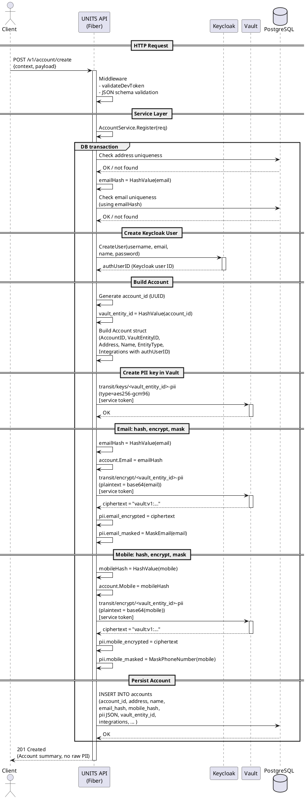

## End-to-End Flow: `POST /v1/account/create` with Vault & Keycloak

This document explains **exactly what happens** when the UNITS API receives an `api.account.create` request like:

```json
{
  "context": {
    "id": "api.account.create",
    "version": "1.0",
    "ts": "2025-09-08T12:00:00Z",
    "msgId": "a3b9c4d8e1f23456b7890abc123def45",
    "developerToken": "{{dev_token}}"
  },
  "payload": {
    "address": "jami@finternet",
    "email": "jami.smith@example.com",
    "password": "securePassword123",
    "name": "jami Smith",
    "mobile": "+7483213349",
    "entityType": "Personal"
  }
}
```

to `{{host}}/v1/account/create`.

It focuses on:

- How the HTTP request flows through the UNITS API
- How **Keycloak** is used
- How **Vault** is used (keys, transit engine, encryption)
- What finally ends up in **PostgreSQL**

---

## 1. High-Level Architecture (Actors)

- **Client**: Your frontend / test client calling `POST /v1/account/create`
- **UNITS API**: Go/Fiber service (`workflow/src`)
- **Keycloak**: Identity provider (user accounts, JWTs)
- **Vault**: Crypto and secret management (encryption, keys, policies)
- **PostgreSQL**: Persistent storage (`accounts`, `key_references`, etc.)

UNITS is configured to use Vault via:

- `CRYPTO_PROVIDER=vault`
- `CRYPTO_CONFIG` JSON (parsed into `VaultConfig`):

```json
{
  "address": "http://vault.vault.svc.cluster.local:8200",
  "token": "dev-token",
  "transitMount": "transit",
  "encryptionKeyName": "units-encryption-master",
  "jwtAuthPath": "jwt",
  "jwtRole": "finternet-user"
}
```

`CRYPTO_CONFIG` is parsed and used to construct a **VaultKeyManager**, which implements both:

- `crypto.KeyManager`
- `crypto.Encryptor`

---

## 2. HTTP/Middleware Flow

### 2.1 Incoming request

- **Method**: `POST`
- **URL**: `/v1/account/create`
- **Body**: JSON envelope shown above (with `context` + `payload`)

### 2.2 Router and middleware

The router for accounts wires the endpoint with standard middleware:

1. **API ID middleware**  
   - Sets `api.account.create` into Fiber context (for logs/tracing).

2. **Developer token validation**  
   - Reads `context.developerToken`.
   - Validates it against configured dev tokens (authZ for API consumers).

3. **JSON schema validation**  
   - Validates the full body against `registration_request.json` (embedded JSON Schema).
   - Ensures required fields, types, formats.

4. **Account controller**  
   - Parses the `payload` into `RegistrationRequest`.
   - Calls `AccountService.Register(ctx, req)`.

From this point, we’re inside the **service layer**.

---

## 3. AccountService.Register – Step-by-Step

Located in `workflow/src/services/account.go`.

### 3.1 Start transaction and validate uniqueness

Inside `Register`:

- Starts a DB transaction using `service.database.WithContext(ctx).Transaction(...)`.
- Validates:
  - `address` is unique: `ExistsWithAddress(ctx, req.Address)`.
  - `email` is unique:
    - Computes `emailHash = HashValue(req.Email)`:
      - Lowercases + trims `req.Email`
      - SHA‑256 → 64‑char hex string
    - Calls `ExistsWithEmail(ctx, emailHash)`.

If any check fails, the transaction is rolled back and an error is returned.

### 3.2 Create Keycloak user

`createAuthUser(ctx, req)` builds an `AuthUserRequest`:

- `Username = req.Address` → `"jami@finternet"`
- `Email = req.Email` → `"jami.smith@example.com"`
- `FirstName = req.Name` → `"jami Smith"`
- `Enabled = true`
- `EmailVerified = false`

Then calls `AuthService.CreateUser(ctx, authReq, req.Password)`:

- Communicates with Keycloak’s **admin REST API** using `AUTH_CONFIG`.
- Creates user in realm `finternet`.
- Sets password `"securePassword123"`.
- Returns a **Keycloak user ID**, e.g.:

```text
4f1a20a0-9cda-43bc-863d-5cfd8c6845f9
```

Let’s call this `authUserID`.

### 3.3 Build `Account` model

`buildAccountFromRequest(req, authUserID)`:

1. Generates a new `accountID` (`uuid.New()`):

   ```text
   account_id = 019ac123-4567-89ab-cdef-0123456789ab  (example)
   ```

2. Computes `vault_entity_id` as a **privacy-preserving identifier**:

   ```go
   vaultEntityID := utils.HashValue(accountID.String())
   ```

   - This is SHA‑256(account_id) as hex (64 chars).
   - This is **not** stored in Vault directly; it’s used in key names.

3. Creates an `Account` struct:

   - `AccountID = account_id`
   - `VaultEntityID = vaultEntityID`
   - `Address = "jami@finternet"`
   - `Name = "jami Smith"`
   - `EntityType = "Personal"`

4. Builds `integrations` JSON:

   ```json
   [
     {
       "provider": "keycloak",
       "external_user_id": "4f1a20a0-9cda-43bc-863d-5cfd8c6845f9",
       "linked_at": "2025-09-08T12:00:00Z"
     }
   ]
   ```

   - Stored in `accounts.integrations` as JSONB.

### 3.4 Create user PII key in Vault

Still in the same transaction:

```go
if _, err := service.cryptoService.CreatePIIKeyForUser(ctx, account.VaultEntityID); err != nil {
    ...
}
```

Flow:

1. `CryptoService.CreatePIIKeyForUser` (in `crypto_user_scoped.go`) type asserts the key manager to a Vault-specific interface:

   ```go
   vaultKM.CreatePIIKeyForUser(ctx, entityID)
   ```

2. `VaultKeyManager.CreatePIIKeyForUser` (in `user_scoped.go`) does:

   ```go
   keyName := fmt.Sprintf("%s-pii", entityID)
   vault write transit/keys/<vault_entity_id>-pii \
     type=aes256-gcm96 \
     exportable=false
   ```

3. Result:

   - Vault creates a symmetric key at `transit/keys/<vault_entity_id>-pii`.
   - This key is dedicated to that user’s PII encryption.

### 3.5 Email: hash, encrypt, mask

If `req.Email` is not empty:

```go
emailHash := utils.HashValue(req.Email)
account.Email = &emailHash

encrypted, err := service.cryptoService.EncryptPIIWithServiceToken(ctx, account.VaultEntityID, req.Email)
piiData.EmailEncrypted = encrypted
piiData.EmailMasked = utils.MaskEmail(req.Email)
```

#### 3.5.1 Hash for uniqueness / lookup

- `utils.HashValue("jami.smith@example.com")`:
  - Normalizes (lowercase + trim).
  - SHA‑256 → e.g. `f39c...` (64 hex chars).
- Stored in `accounts.email`.
- Used for uniqueness and lookups **without** storing plaintext.

#### 3.5.2 Encrypt using Vault PII key

- `EncryptPIIWithServiceToken(ctx, vaultEntityID, plaintext)`:
  - Calls `VaultKeyManager.EncryptPIIWithServiceToken`.
  - Uses **service token** (from `CRYPTO_CONFIG`).
  - Path: `transit/encrypt/<vault_entity_id>-pii`.
  - Request:

    ```json
    {
      "plaintext": "base64(\"jami.smith@example.com\")"
    }
    ```

  - Response:

    ```json
    {
      "ciphertext": "vault:v1:abcd..."
    }
    ```

- That ciphertext is stored as `pii.email_encrypted`.

#### 3.5.3 Mask for display

- `utils.MaskEmail("jami.smith@example.com")` →
  - `"j***@example.com"`.
- Stored as `pii.email_masked`.

### 3.6 Mobile: hash, encrypt, mask

Similarly for `req.Mobile`:

```go
mobileHash := utils.HashValue(req.Mobile)
account.Mobile = &mobileHash

encrypted, err := service.cryptoService.EncryptPIIWithServiceToken(ctx, account.VaultEntityID, req.Mobile)
piiData.MobileEncrypted = encrypted
piiData.MobileMasked = utils.MaskPhoneNumber(req.Mobile)
```

- `HashValue("+7483213349")` → 64‑char hex stored in `accounts.mobile`.
- Vault encryption:
  - Path: `transit/encrypt/<vault_entity_id>-pii`
  - Stores ciphertext as `pii.mobile_encrypted`.
- `MaskPhoneNumber("+7483213349")` → e.g. `"+7***3349"`.
  - Stored as `pii.mobile_masked`.

### 3.7 Persist PII JSON and Account in DB

`account.SetPII(&piiData)` serializes:

```json
{
  "email_encrypted": "vault:v1:...",
  "email_masked": "j***@example.com",
  "mobile_encrypted": "vault:v1:...",
  "mobile_masked": "+7***3349"
}
```

into `accounts.pii` (JSONB).

Then `accountRepo.Create(ctx, account)` inserts one row into `accounts`:

- `account_id`: UUID
- `address`: `"jami@finternet"`
- `name`: `"jami Smith"`
- `email`: hash of email
- `mobile`: hash of mobile
- `pii`: JSON with encrypted + masked PII
- `vault_entity_id`: SHA‑256(account_id)
- `entity_type`: `"Personal"`
- `integrations`: Keycloak link JSON
- Timestamps: `created_at`, `updated_at`

The transaction commits and the controller returns the account (without plaintext PII).

---

## 4. Role of Keycloak and Vault

### 4.1 Why Keycloak?

In this flow:

- Keycloak is used to:
  - Create the **identity** (user account, credentials).
  - Provide an `external_user_id` which is stored in `accounts.integrations`.

Later:

- When the user logs in and calls APIs that require signing or PII access:
  - UNITS receives a **Keycloak JWT**.
  - Vault uses that JWT (through the `jwt` auth method) to:
    - Identify the user’s Vault **entity**.
    - Enforce policies that only allow that entity to access its own keys.

So Keycloak is the **source of truth for user identity**, and Vault trusts Keycloak’s JWTs for user-scoped cryptographic operations.

### 4.2 Why Vault?

Vault is responsible for:

- Managing keys:
  - `transit/keys/units-encryption-master`
  - `transit/keys/<vault_entity_id>-pii`
  - Per-user signing keys.
- Performing encryption/decryption:
  - PII encryption using user PII keys.
  - Master key used for encrypting private keys (for signing).
- Enforcing access control (policies):
  - Service token limited by `service-admin` policy.
  - User tokens limited by `user-transit-keys` and `user-pii-encryption` policies.

The **database never stores raw PII**, only hashes and Vault ciphertexts.

---

## 5. Sequence Diagram (PlantUML)

The following diagram shows the `/v1/account/create` flow:



You can paste this diagram into a PlantUML renderer (or use a plugin) to see the full visual flow.

---

## 6. Summary

When you call `POST /v1/account/create` with the example payload:

- UNITS:
  - Validates the request.
  - Creates a user in Keycloak.
  - Generates `account_id` and `vault_entity_id`.
  - Creates a per-user PII key in Vault.
  - Hashes and encrypts email + mobile via Vault.
  - Masks PII for display.
  - Stores **only hashes and Vault ciphertexts** in PostgreSQL.
- Keycloak:
  - Stores the user identity and credentials.
  - Later issues JWTs for user-scoped cryptography.
- Vault:
  - Stores keys and performs encryption/decryption.
  - Enforces strict policies over which keys can be used by which tokens.

This design ensures that:

- The database never sees raw PII.
- Encryption keys stay in Vault.
- User-scoped operations are possible and safe via JWT + Vault policies.


